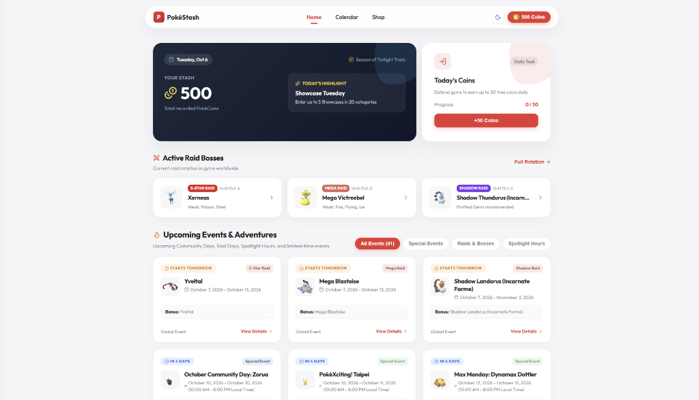
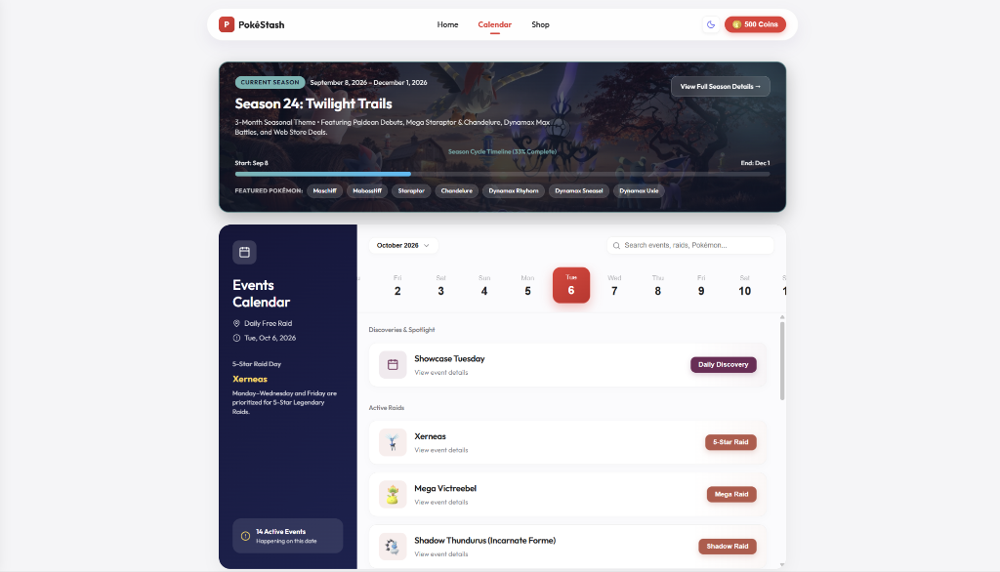
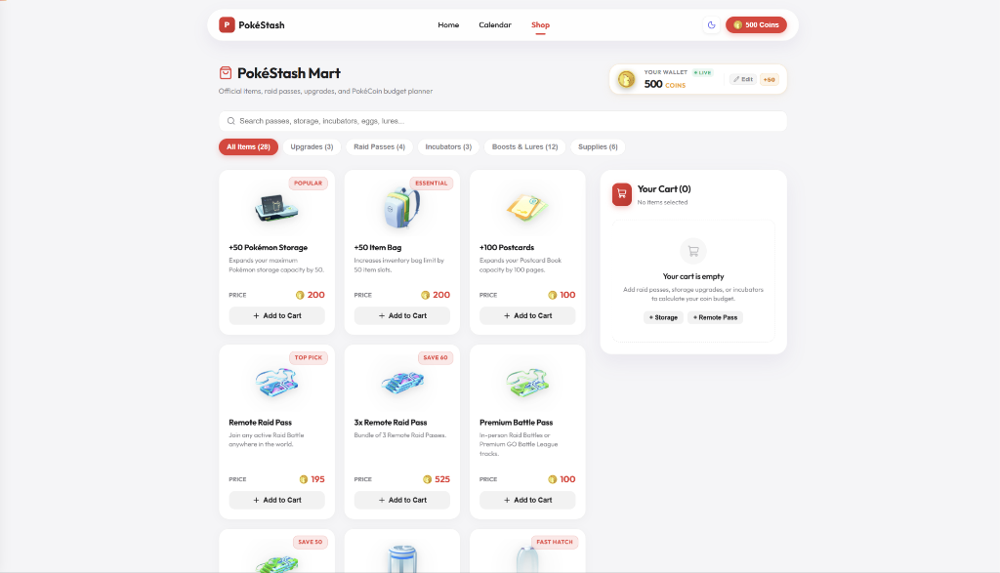

# PokéStash 🎯🪙

> **PokéStash solves the hassle of tracking fragmented Pokémon GO schedules and raid rotations by providing trainers with an all-in-one live event tracker, interactive monthly calendar, and gym PokéCoin budget calculator.**

[](https://react.dev/)
[](https://vitejs.dev/)
[](https://nodejs.org/)
[](https://cheerio.js.org/)
[](https://developer.mozilla.org/en-US/docs/Web/JavaScript)
[](https://oxc.rs/)
[](LICENSE)

---

## 🌐 Live Access

You don't need to install or run anything locally to use PokéStash! You can access the live app instantly by clicking the **GitHub Pages website link** found directly in the **About** section on the right side of this repository.

---

## 📸 App Preview

| 🏠 Home Dashboard | 📅 Events Calendar |
| :---: | :---: |
|  |  |

| 🛒 PokéStash Mart & Budget Calculator |
| :---: |
|  |

---

## 🛠️ Tech Stack

- **Frontend Core**: [React 19](https://react.dev/) with functional hooks and state-driven tabs
- **Build & Tooling**: [Vite](https://vitejs.dev/) for high-speed hot module replacement (HMR) and optimized builds
- **Icons & UI Assets**: [Lucide React](https://lucide.dev/) + official Pokémon GO 3D HOME renders
- **Data Scraping & Extraction**: [Node.js](https://nodejs.org/) & [Cheerio](https://cheerio.js.org/) for automated web scraping and HTML parsing of community event feeds
- **Storage & State Persistence**: Browser `localStorage` for seamless offline persistence of coin wallets, custom targets, and cart data
- **Code Quality**: [Oxlint](https://oxc.rs/) for ultra-fast JavaScript linting

---

## 🚀 Features & Roadmap

### ✅ Functional Features
- **🏠 Live Home Dashboard**:
  - Daily highlights (Showcase Tuesday, Max Mondays, Raid hours, Spotlight hours).
  - Active 5-star, Mega, and Shadow raid bosses showing current rotations and weakness types.
  - Upcoming events countdown feed with quick category filters.
  - Real-time daily PokéCoin claim button and persistent stash counter.
- **📅 Interactive Events Calendar**:
  - Full seasonal timeline tracker (e.g., Season 24: Twilight Trails).
  - Day-by-day interactive date picker displaying all events active on any selected day.
  - Comprehensive modal view for events containing wild encounters, egg pools, shiny statuses, and event advice.
- **🛒 PokéStash Mart & Budget Planner**:
  - In-game shop catalog with official bundles, storage upgrades, raid passes, incubators, and lures.
  - Interactive cart calculator showing total coin cost.
  - Gym defense days estimator based on the 50 free coins/day cap.
  - Custom wallet balance editor to track savings toward target items.
- **🎨 Smart 3D Asset Resolution**:
  - Dynamic fallback system mapping Pokémon names and costume forms (e.g., Gigantamax forms, Minior cores, Batik Shirt Pikachu) to official high-resolution 3D sprites.

### 🗺️ Roadmap / In Progress (Scraping Speed & Efficiency)
- [ ] **Multi-Stream Request Concurrency**: Implement parallelized scraping with connection pooling to dramatically reduce scrape execution time.
- [ ] **Incremental Delta Scraping**: Add HTTP ETag and conditional `If-Modified-Since` checking to only crawl pages that have received new updates.
- [ ] **Headless Resiliency Engine**: Integrate a headless fallback pipeline (Playwright / Puppeteer) to bypass rate limits and capture dynamically injected event scripts.
- [ ] **Automated Sprite Mirroring & Ingestion**: Streamline asset downloads directly into compressed local bundles during scrape runs to eliminate runtime 404s.
- [ ] **Scheduled CI Scraper Workflow**: Configure GitHub Actions cron jobs to run nightly scrapes and automatically commit validated event payloads.

---

## 💻 Local Development

If you wish to run PokéStash locally:

```bash
# 1. Clone the repository
git clone https://github.com/Seraphingel/pokestash.git

# 2. Navigate to project root
cd pokestash

# 3. Install dependencies
npm install

# 4. Start Vite development server
npm run dev
```

Visit `http://localhost:5173/PokeStash/` in your browser.

### Scripts
- `npm run dev`: Launch local development server
- `npm run build`: Build production assets
- `npm run lint`: Run Oxlint across the project
